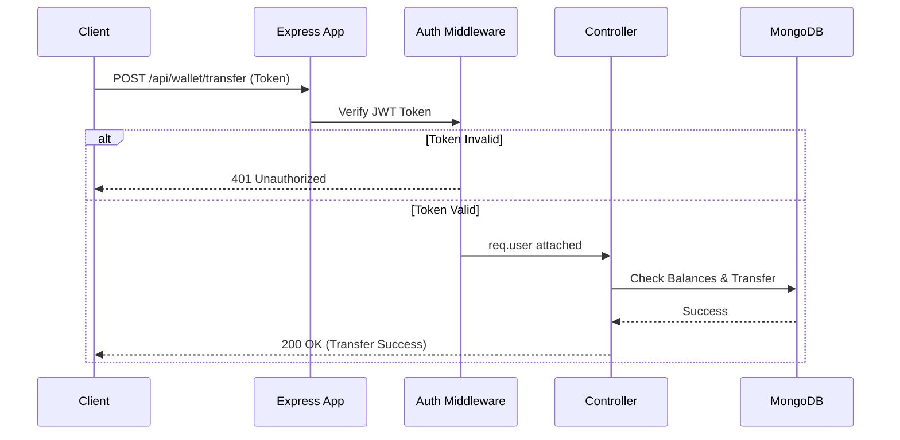
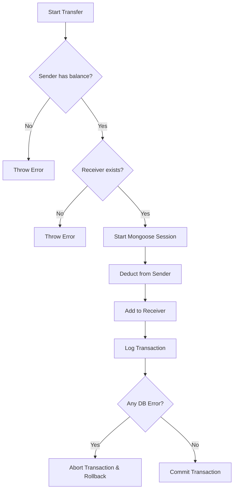

# SchoolFee Now - Viva Preparation Guide

This document contains comprehensive answers to the "27. Viva Questions" section from the Semester Project Brief, specifically tailored to the **SchoolFee Now** implementation.

## 27.1 React and Frontend

**1. Which React components are reusable in your project and why?**
We built several reusable components such as `LoadingSpinner`, `AlertError`, `MetricCard`, and `StatusBadge`. These are reusable because they accept props (like message, title, value, or status) and return consistent UI elements across different pages without duplicating code.

**2. How does your protected route work?**
Our `ProtectedRoute` component uses the `AuthContext` to check if a user is logged in and if their `role` matches the `allowedRoles` array passed as a prop. If not authenticated, it uses React Router's `Navigate` to redirect them to `/login`.

**3. How do you show loading state during API calls?**
We use a boolean `loading` state (often from our `useFetch` hook). When true, we render the reusable `LoadingSpinner` component. Once the API resolves (in the `finally` block), `loading` is set to false and the actual UI renders.

**4. How do you show backend validation errors in the UI?**
We capture the error in the `catch` block of our async functions using `err.response?.data?.message`. We then set an `error` state, which is displayed using the `AlertError` component or globally via `react-hot-toast`.

**5. How does your role-based navigation change for user and admin?**
In `Sidebar.jsx`, we have arrays of links defined for `parent`, `school_admin`, `system_admin`, and `student`. We check `user.role` from `AuthContext` and dynamically render the corresponding link array.

**6. Which pages call real backend APIs?**
Every data-driven page calls real APIs. For instance, the Dashboard (`/plans`, `/transactions/summary/monthly`), Wallet (`/wallet`, `/wallet/deposit`), Admin pages (`/admin/users`, `/admin/transactions`), and System Admin pages.

**7. How do you prevent a logged-out user from seeing dashboard pages?**
Our `AppRoutes.jsx` wraps all dashboard routes inside the `ProtectedRoute` wrapper, which strictly checks for the presence of a valid `user` state (populated via JWT) before rendering the child route.

**8. How do you handle empty transaction or expense lists?**
In our `.map()` rendering logic, we conditionally check if `array.length === 0`. If true, we render a fallback table row or div (e.g., `<td colSpan='5'>No transactions found.</td>`) to prevent an empty screen.

**9. What animation style did your group choose and why?**
We chose smooth, subtle CSS transitions (fade-ins) and hover effects (scale-up on cards). This aligns with modern FinTech aesthetics, providing a premium feel without overwhelming the user.

**10. How did you test responsiveness on mobile?**
We utilized Chrome DevTools Device Mode to test various viewports (iPhone, iPad). We wrote our CSS using a mobile-first flexbox approach and media queries (e.g., `flex-col md:flex-row`) to stack elements nicely on small screens.

---

## 27.2 API Integration

**1. Where is your backend base URL configured?**
It is configured in `frontend/src/services/api.js` using the `axios.create()` method, reading from `import.meta.env.VITE_API_URL` with a fallback to the deployed Render URL.

**2. How do you attach JWT token with API requests?**
In `api.js`, we have an `axios.interceptors.request.use` interceptor that reads the `token` from `localStorage` and automatically attaches it to the `Authorization` header as `Bearer ${token}`.

**3. What happens when backend returns 401?**
A 401 Unauthorized response triggers our response interceptor, which globally displays an error toast. If the token is entirely invalid, the auth context clears the state and redirects to `/login`.

**4. What happens when backend returns 403?**
A 403 Forbidden means the user is authenticated but lacks the required role (e.g., a parent trying to access an admin route). The response interceptor shows a toast, and the UI prevents access.

**5. How do you handle API failure in a form?**
We wrap our API call in a `try/catch` block. On `catch`, we extract the backend error message, set it to the local `error` state, and display it above the form using `AlertError`. We also reset the `submitting` state.

**6. Which API is called after deposit?**
The frontend calls `POST /api/wallet/deposit` with the `amount` payload.

**7. Which API is called after transfer?**
The frontend calls `POST /api/wallet/transfer` with `amount` and `receiverEmail`.

**8. How do you refresh dashboard data after a transaction?**
After a successful transaction modal submit, we call the `fetchWallet()` or `fetchTransactions()` function again to pull the fresh, mathematically correct data from the backend.

**9. Why should frontend not calculate final wallet balance?**
The frontend is insecure and can be manipulated by users via browser console. The backend must mathematically enforce deposits, withdrawals, and limits (Atomic operations) to ensure financial data integrity and prevent double-spending.

**10. How do you keep services/API functions organized?**
We centralize Axios configuration in `services/api.js` (handling base URL, headers, and interceptors). We also use custom hooks like `useFetch` to cleanly handle data fetching, loading, and error states across components.

---

## 27.3 Node and Express

**1. What is the purpose of app.js and server.js?**
`app.js` sets up the Express application, configures middlewares (CORS, helmet, express.json), and mounts the routes. `server.js` is the entry point that connects to MongoDB and actually starts the HTTP listener on the specified PORT. This separation is great for testing.

**2. Why did you separate routes and controllers?**
Routes define the HTTP method and URL endpoints, routing traffic to the correct handler. Controllers contain the actual business logic. This separation keeps code clean, readable, and modular.

**3. How do you connect to MongoDB?**
In `backend/config/db.js`, we use `mongoose.connect()` with the `MONGO_URI` from our environment variables. We handle the promise to log success or exit the process on failure.

**4. How do you handle async errors?**
We use `try/catch` blocks inside our async controllers. If an error occurs, we pass it to the `next(error)` function, which routes it to our centralized error-handling middleware.

**5. What is your response format for success and failure?**
Success: `{ success: true, data: { ... }, message: "Optional" }`
Failure: `{ success: false, message: "Error description" }`

**6. How does your health route prove deployment?**
We have an `app.get('/api/health')` route returning `{ success: true, message: 'API is running' }`. By visiting this deployed endpoint, anyone can verify the Node server is active.

**7. How do you load environment variables?**
We use the `dotenv` package. Calling `dotenv.config()` reads our `.env` file and loads variables into `process.env` (e.g., `process.env.JWT_SECRET`).

**8. Where is transaction ID generated?**
It is generated securely in the backend controller (e.g., `walletController.js`) using a utility function or crypto, ensuring the frontend cannot spoof transaction IDs.

**9. Where is suspicious rule logic placed?**
It is placed in `backend/utils/suspiciousRules.js` and imported into the `walletController`. It intercepts the transaction before saving, runs 5 checks, and sets the `suspiciousFlag` if needed.

**10. How do you prevent duplicate logic across controllers?**
We extract common logic into utility files (like `suspiciousRules.js` or `generateToken.js`) and middleware (like `authMiddleware.js`).

---

## 27.4 Middleware

**1. What does auth middleware check?**
It extracts the token from the `Authorization: Bearer <token>` header, verifies it using `jwt.verify()` and `JWT_SECRET`, and fetches the user from MongoDB, attaching it to `req.user`.

**2. What does role middleware check?**
After `authMiddleware` runs, `authorize(...roles)` checks if `req.user.role` is included in the permitted roles array. If not, it returns a 403 Forbidden.

**3. Where do you use validation middleware?**
We validate incoming data (e.g., ensuring `amount` is a positive number) strictly inside the controller before hitting the database.

**4. What does error middleware do?**
`errorHandler` captures any error passed to `next()`. It formats the error safely (hiding stack traces in production) and returns a consistent JSON response.

**5. What does not-found middleware do?**
If a request URL doesn't match any defined route, this middleware catches it, creates a 404 Error, and passes it to the error handler.

**6. Where would rate limiting be useful?**
We applied `express-rate-limit` globally to prevent brute-force attacks and DDoS by limiting requests from a single IP within a timeframe.

**7. What should logging middleware not log?**
It should never log sensitive user data like passwords, JWT tokens, credit card numbers, or full authorization headers.

**8. How can ownership middleware protect expenses?**
By ensuring that the requested expense's `userId` matches the logged-in `req.user._id`, preventing users from reading/editing others' data.

**9. Why is middleware better than repeating checks in every route?**
It adheres to the DRY (Don't Repeat Yourself) principle. Centralized checks reduce bugs and ensure uniform security enforcement across the app.

**10. Explain the order of middleware in your Express app.**
Security headers (`helmet`) -> CORS -> Body parsers (`express.json`) -> Rate Limiters -> Logging -> Feature Routes -> Not Found Middleware -> Error Handler.

---

## 27.5 JWT and Security

**1. Why do we use bcrypt?**
We use `bcryptjs` to hash passwords with a salt. It prevents passwords from being readable in the database, protecting users even if the database is compromised.

**2. Why should JWT secret not be uploaded?**
If attackers get the `JWT_SECRET`, they can sign their own tokens and log in as any user, including system admins, completely bypassing password checks.

**3. What information did you include in JWT payload?**
We include the user's `id`. We avoid putting sensitive data (like passwords or full balances) in the token.

**4. How do you handle token expiry?**
The token is signed with an `expiresIn` (e.g., 30d). If an expired token is used, `jwt.verify()` throws an error, our middleware catches it, sends a 401, and the frontend redirects to login.

**5. Why is backend authorization compulsory?**
Frontend code runs on the client machine and can be altered. An attacker can un-hide admin buttons. Backend authorization ensures the API strictly rejects unauthorized operations regardless of UI.

**6. How do you protect admin APIs?**
By stacking middlewares on the route: `router.get('/', protect, authorize('school_admin'), controllerFunc)`.

**7. How do you prevent plain-text password storage?**
In our Mongoose `User` model, we use a `.pre('save')` hook to run `bcrypt.hash()` on the password before it is saved to MongoDB.

**8. How do you validate ObjectId values?**
Mongoose naturally casts strings to ObjectIds, but if an invalid format is passed, it throws a `CastError`. We handle this in our error middleware to return a 400 Bad Request.

**9. What is CORS and how did you configure it?**
Cross-Origin Resource Sharing. We use the `cors()` middleware in `app.js`, configuring the `origin` to match our deployed frontend URL so the browser permits cross-domain requests.

**10. What security issue happens if balance is accepted from frontend?**
A user could intercept the network request and change `balance: 9999999` in the JSON payload, granting themselves infinite funds. The backend must calculate it locally.

---

## 27.6 MongoDB and Mongoose

**1. Explain your users schema.**
It contains `name`, `email` (unique), `passwordHash`, `role` (default user), `status` (active/blocked), and timestamps. It represents the core identity.

**2. Explain your wallets schema.**
It contains `userId` (refers to User), `balance`, `currency`, and tracks total inflow/outflow.

**3. Explain your transactions schema.**
Tracks `senderId`, `receiverId`, `amount`, `type` (deposit/transfer), `status`, `suspiciousFlag` (boolean), and `suspiciousReasons` (array of strings).

**4. Why did you choose these fields for suspicious reasons?**
By storing reasons as an array of strings, an admin can see exactly *why* a transaction was flagged (e.g., "Transfer over threshold", "High deposit velocity").

**5. How are expenses connected to users?**
Each Expense document has a `userId` field containing the ObjectId of the User who created it.

**6. How are budgets connected to users?**
Similar to expenses, a Budget document links to a `userId` and tracks limits for a specific `month`.

**7. Which fields are unique?**
`email` in the Users schema and `transactionId` in the Transactions schema.

**8. Which fields are required?**
Fields crucial to logic: `email`, `passwordHash`, `amount` in transactions, `balance` in wallets.

**9. Where would indexes be useful?**
On `email` for fast login lookups, and on `userId` in transactions/expenses for fast history retrieval.

**10. Show a sample document from MongoDB Atlas and explain it.**
*(You will pull up MongoDB Atlas during Viva to show this. Example: A transaction document showing amount, sender, receiver, and suspiciousFlag=false).*

---

## 27.7 Wallet and Transaction Logic

**1. Explain the deposit flow from frontend to database.**
User enters amount -> Frontend calls `POST /api/wallet/deposit` -> Backend validates amount > 0 -> Updates wallet `balance` -> Creates `Transaction` record (status: successful) -> Returns updated balance.

**2. Explain the withdrawal flow from frontend to database.**
Similar to deposit, but backend first checks if `wallet.balance >= amount`. If not, returns 400 Insufficient Balance. Otherwise, deducts amount and logs transaction.

**3. Explain the transfer flow from frontend to database.**
Backend checks sender balance -> verifies receiver email exists and is not self -> runs suspicious checks -> wraps operation in a **Mongoose Session/Transaction** (ACID) -> deducts from sender -> adds to receiver -> saves Transaction log.

**4. How do you check sufficient balance?**
`if (wallet.balance < amount) throw new Error('Insufficient balance');`

**5. How do you prevent transfer to self?**
`if (sender._id.toString() === receiver._id.toString()) throw new Error('Cannot transfer to yourself');`

**6. Why should every successful operation create a transaction record?**
For auditability, history rendering, and resolving disputes. Without records, money movement is untraceable.

**7. Do you record failed transactions? Why or why not?**
We log them where applicable (e.g., blocked user attempts) so admins can monitor malicious activity.

**8. How do you generate receipts?**
We fetch the transaction by ID and display its details in a printable layout on the frontend (`/transactions/:id/receipt`).

**9. How do you handle transaction status?**
The `status` field is an enum (`pending`, `successful`, `failed`, `flagged`). The backend assigns this based on the operation's outcome and the suspicious rules engine.

**10. How do you update sender and receiver balances?**
Inside a Mongoose session: `senderWallet.balance -= amount;` and `receiverWallet.balance += amount;`. Then `.save()` is called on both.

---

## 27.8 Suspicious Transaction Rules

**1. List your five suspicious transaction rules.**
1. Very high deposit (>1M PKR)
2. Very high transfer (>500k PKR)
3. Transfer from a newly registered account (within 24 hours)
4. Transfer to a recently flagged user
5. Rapid velocity (e.g., high volume in short time)

**2. Why did you choose your high-value threshold?**
We set it relative to average educational demo expenses (e.g., tuition fees are 50k-200k, so 1M is suspicious).

**3. How do you detect more than five transfers within ten minutes?**
By querying the database for transactions belonging to the sender in the last 10 minutes and checking the `.countDocuments()`.

**4. How do you detect repeated same amount transfers?**
Querying the sender's history in the last hour for transactions matching the exact `amount`.

**5. How do you detect failed withdrawal attempts?**
By storing failed logs and querying their frequency.

**6. Where do you store suspicious reasons?**
In the `suspiciousReasons` array inside the `Transaction` document.

**7. How does admin view flagged transactions?**
Admin fetches `/api/admin/transactions/flagged`, which queries `{ suspiciousFlag: true }` and displays the reasons.

**8. Why is this rule-based and not machine learning?**
Because the project scope demands deterministic backend logic and exact threshold explanations, which is reliable for an educational MVP.

**9. How would you change one threshold live?**
I can edit `utils/suspiciousRules.js` (e.g., change `1000000` to `500000`), restart the server, and make a transfer to trigger it.

**10. How do you test a suspicious rule?**
I log in, attempt a 2M PKR transfer. The UI should complete it, but looking at the transaction history, it will have a Red "Flagged" badge.

---

## UML Architectures (Mermaid)

### 1. Request Flow (Middleware)

### 2. ACID Wallet Transfer (Atomic)

